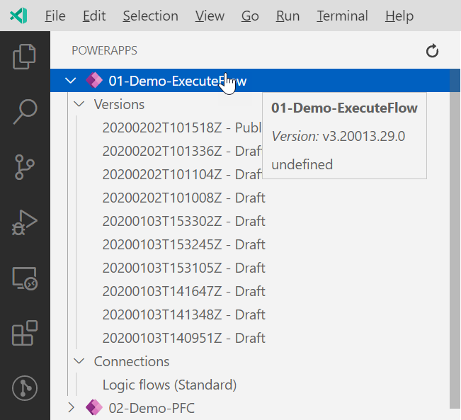
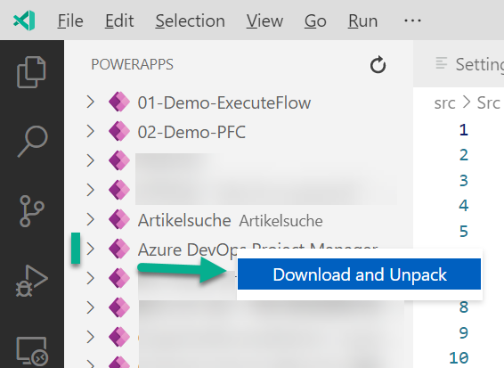
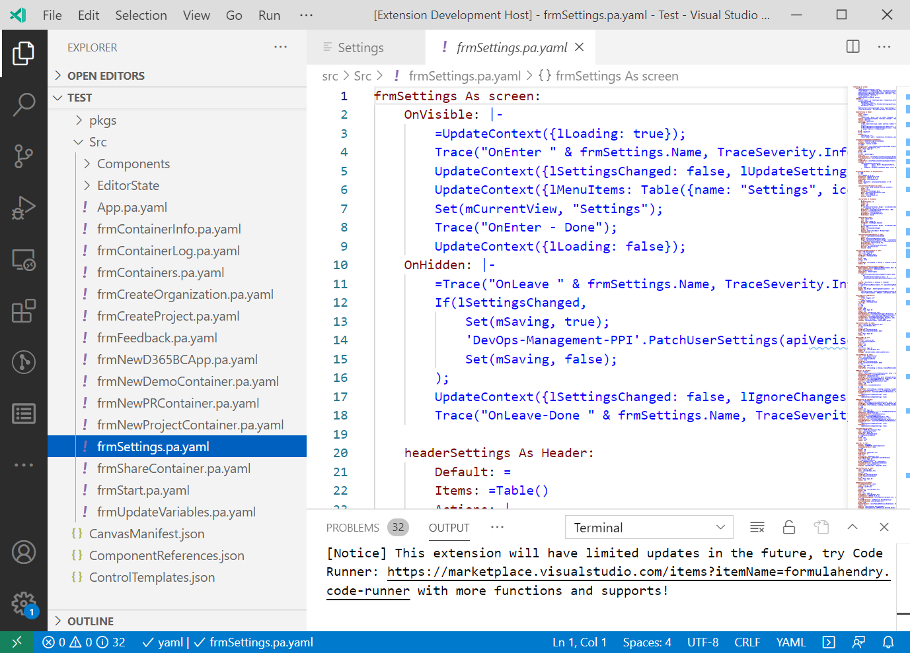
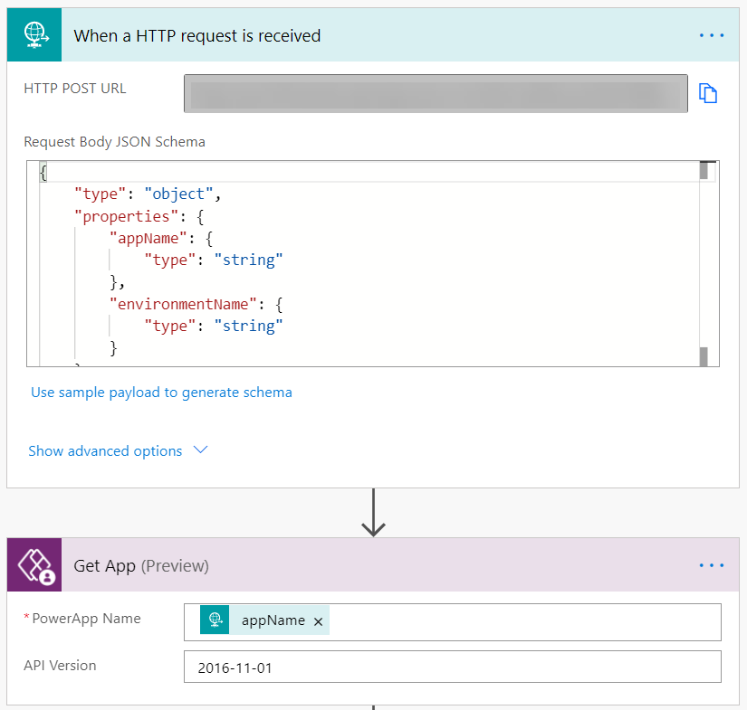
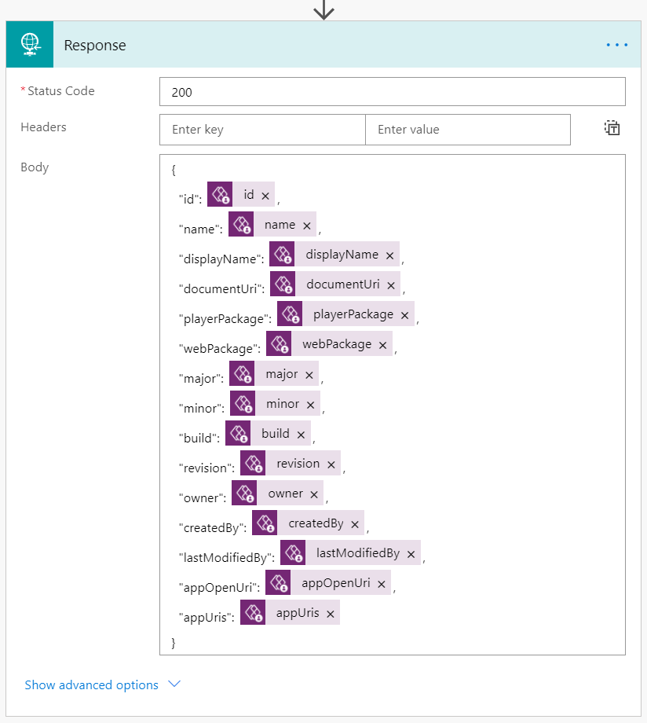
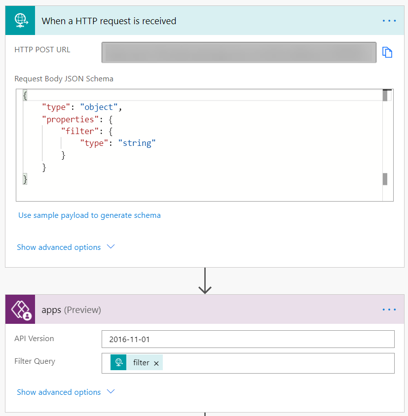
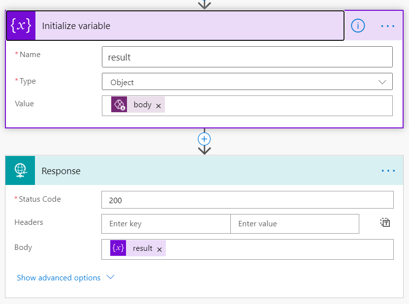
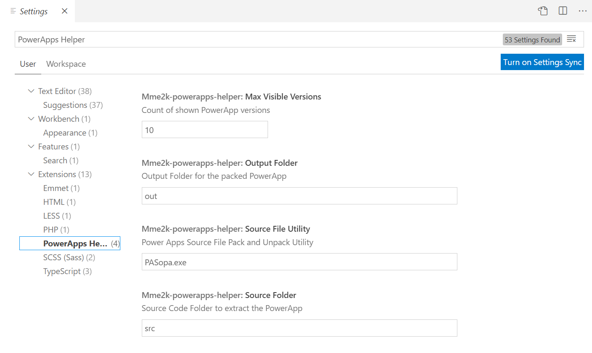

# Powerapps-Helper VSCode Extension

This is the README for your extension "powerapps-helper". After writing up a brief description, we recommend including the following sections.

## Features

The extension adds a View to VSCode, which contains all PowerApps from required **[GetApps PowerAutomate Flow](#GetApps)**



Use the [PowerApps-Language-Tooling](https://github.com/microsoft/PowerApps-Language-Tooling) to  downloaded and Unpack PowerApp to your local project:



As result you get your PowerApp sources as follows:



## Requirements

This extension is need these PowerAutomated Flows to get information from your PowerApps Environment:

1. [PowerApps for App Makers - Get App](https://docs.microsoft.com/en-us/connectors/powerappsforappmakers/#get-app) to provide PowerApp information to the VSCode Extension
1. [PowerApps for App Makers - Get Apps](https://docs.microsoft.com/en-us/connectors/powerappsforappmakers/#get-apps) to provide PowerApp information to the VSCode Extension PowerApps Tree

Furthermore, you need to download and compile the [PowerApps-Language-Tooling](https://github.com/microsoft/PowerApps-Language-Tooling) to extract the PowerApp from `msapp` (Archive) format into `YAML`. Read more about this on: [Source code files for Canvas apps](https://powerapps.microsoft.com/en-us/blog/source-code-files-for-canvas-apps/)

### GetApp

This flow provide via Http-Request information about a PowerApp of a specified environment:

```http
POST https://flow-http-request-url
Content-Type: application/json

{
    "appName": "<app-id>",
    "environmentName": "<environment-id>"
}
```




[GePowerApps for App Makers - Get App](https://docs.microsoft.com/en-us/connectors/powerappsforappmakers/#get-app)

### GetApps

This flow provide via Http-Request information about all PowerApps of the current environment:

```http
POST https://flow-http-request-url
Content-Type: application/json

{
    "filter": ""
}
```




[PowerApps for App Makers - Get Apps](https://docs.microsoft.com/en-us/connectors/powerappsforappmakers/#get-apps)

## Extension Settings

This extension contributes the following settings:

* `mme2k-powerapps-helper.SourceFileUtility`: Path to the [PowerApps-Language-Tooling](https://github.com/microsoft/PowerApps-Language-Tooling) binary (`PASopa.exe`)
* `mme2k-powerapps-helper.GetPowerAppUrl`: Url of the [GetApp PowerAutomate Flow](#GetApp)
* `mme2k-powerapps-helper.GetPowerAppsUrl`: Url of the [GetApps PowerAutomate Flow](#GetApps)
* `mme2k-powerapps-helper.SourceFolder`: Source Code Folder to extract the PowerApp
* `mme2k-powerapps-helper.OutputFolder`: Output Folder for the packed PowerApp



**Note:** Don't forget to configure the 2  PowerAutomate Flows [GetApp](#GetApp) and [GetApps](#GetApps).

## Known Issues

* Only Download of Published PowerApps possible
* needed PowerAutomated Flows to get PowerApp information
* no Pack and Upload of PowerApp, because there is no API

## Release Notes

The extension is currently in development.

### 0.0.1

Initial Working Preview
